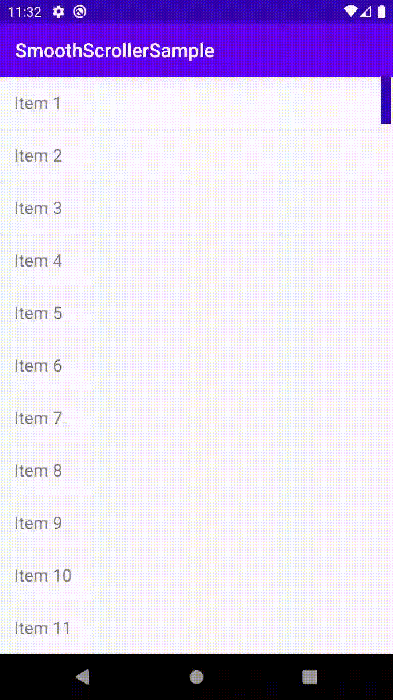

# SmoothScrollerSample

A sample for `SmoothScroller` library (specifically, [SmoothScroller.java](smoothscroller/src/main/java/com/kishanprao/smoothscroller/SmoothScroller.java)), created in 2016.
The library provides a simple GUI element to perform smooth scrolling of Android's RecyclerView.

## Demo
Scrolling a simple RecyclerView:

